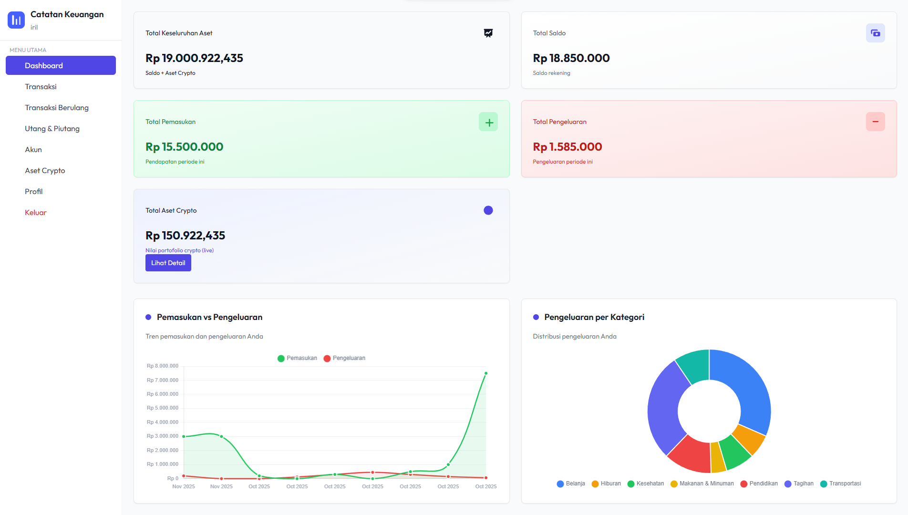
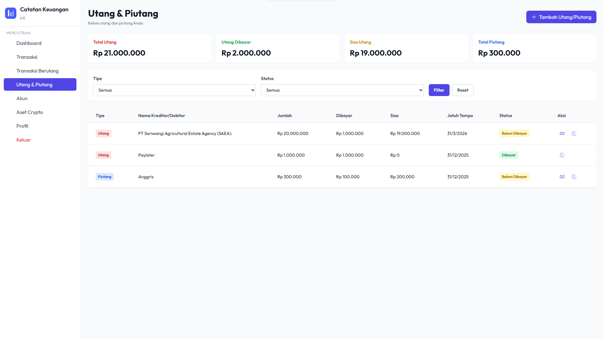
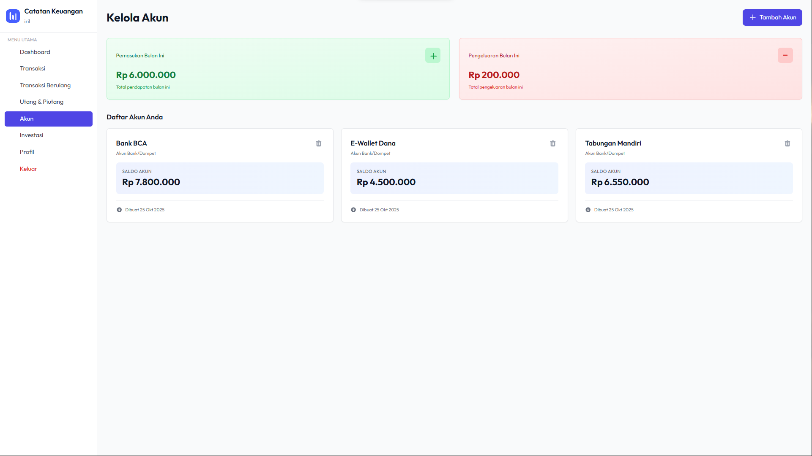
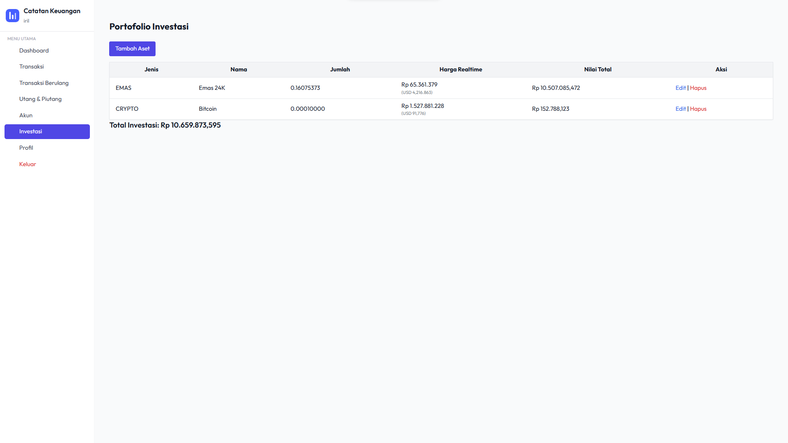

# 💰 Financial App

> Aplikasi manajemen keuangan pribadi lengkap dengan fitur transaksi, investasi crypto & emas, hutang piutang, dan rekening bank.

[](https://nodejs.org/)
[](https://expressjs.com/)
[](https://www.mysql.com/)
[](https://tailwindcss.com/)

## 📸 Screenshot

<div align="center">
  
  
  
  
</div>

## ✨ Fitur Utama

### 📊 Dashboard & Transaksi
- **Dashboard Interaktif** - Visualisasi keuangan dengan grafik dan ringkasan realtime
- **Manajemen Transaksi** - Catat pemasukan & pengeluaran dengan kategori
- **Laporan Transaksi** - Export ke Excel/PDF dengan filter tanggal
- **Transaksi Berulang** - Otomasi pencatatan transaksi rutin (bulanan/harian)

### 💼 Investasi (Crypto & Emas)
- **Portofolio Investasi** - Kelola aset crypto (Bitcoin, Ethereum, dll) dan emas
- **Harga Realtime** - Integrasi dengan CoinGecko API & MetalPriceAPI
- **Multi Unit** - Input dalam Coin/Gram/Troy Ounce dengan konversi otomatis
- **Cache Harga Emas** - Sistem caching 24 jam untuk efisiensi API

### 🏦 Rekening & Hutang Piutang
- **Multi Akun** - Kelola berbagai rekening bank (saldo, mutasi)
- **Hutang & Piutang** - Tracking pembayaran dengan status dan kategori
- **Pembayaran Cicilan** - Catat pembayaran parsial dengan riwayat

### 👨‍💼 Admin Panel
- **Manajemen User** - CRUD users dengan role (admin/user)
- **Master Data** - Kelola kategori, metode pembayaran, provider investasi
- **Gold Cache Admin** - Monitor dan refresh cache harga emas

## 🛠️ Teknologi

**Backend:**
- Node.js + Express.js
- MySQL2 (Database)
- express-session (Authentication)
- bcryptjs (Password hashing)
- dotenv (Environment variables)

**Frontend:**
- EJS (Templating)
- Tailwind CSS (Styling)
- Chart.js (Visualisasi)
- Axios (HTTP client)

**API Integrasi:**
- CoinGecko API - Harga crypto realtime
- MetalPriceAPI - Harga emas (XAU/USD)
- ExchangeRate.host - Kurs USD→IDR

## 📋 Persyaratan Sistem

- **Node.js** >= 16.x
- **MySQL** >= 8.0
- **npm** >= 8.x

## 🚀 Instalasi & Setup

### 1. Clone Repository
```bash
git clone https://github.com/kaizeenn/financial-app.git
cd financial-app
```

### 2. Install Dependencies
```bash
npm install
```

### 3. Setup Database
```sql
-- Buat database
CREATE DATABASE catatan;

-- Import schema dari file sql/catatan.sql
mysql -u root -p catatan < sql/catatan.sql
```

### 4. Konfigurasi Environment
Buat file `.env` di root project:
```env
# Database
DB_HOST=localhost
DB_USER=root
DB_PASSWORD=
DB_NAME=catatan

# API Keys
METALAPI_KEY=your_metalpriceapi_key_here
USD_IDR_RATE=15500

# Session (optional)
SESSION_SECRET=your_secret_key_here
```

### 5. Build CSS (Development)
```bash
npm run build:css
# atau watch mode:
npm run watch:css
```

### 6. Jalankan Aplikasi
```bash
npm start
# atau development mode:
npm run dev
```

Aplikasi berjalan di: **http://localhost:3000**

## 🔑 Default Login

**Admin:**
- Username: `atmin`
- Password: `atmin123`

**User:**
- Username: `iril`
- Password: `iril123`

## 📁 Struktur Folder

```
financial-app/
├── bin/
│   └── www                 # Entry point
├── config/
│   └── db.js              # Koneksi database
├── controllers/           # Business logic
│   ├── investmentController.js
│   └── ...
├── middleware/            # Auth & role middleware
├── routes/               # Route handlers
│   ├── admin.js
│   ├── investmentRoutes.js
│   └── ...
├── services/             # External API services
│   └── investmentPriceService.js
├── views/                # EJS templates
│   ├── admin/
│   ├── user/
│   ├── layout/
│   └── partials/
├── public/               # Static files
│   ├── stylesheets/
│   └── images/
├── scripts/              # Utility scripts
│   └── migrate_gold_to_metal.js
└── sql/                  # Database schema
    └── catatan.sql
```

## 🔧 Migrasi Database

Jika upgrade dari GoldAPI ke MetalPriceAPI:
```bash
node scripts/migrate_gold_to_metal.js
```

## 📊 Fitur API

### Endpoint Harga Investasi
```http
GET /invest/get-price?asset_id=<ID>
```
Response:
```json
{
  "usd": 2024.50,
  "idr": 31025000,
  "rate": 0.0004941
}
```

### Admin Gold Cache
```http
GET /admin/gold-cache        # View cache
POST /admin/gold-cache/refresh  # Force refresh
```

## 🎨 Customization

### Tambah Provider Investasi
Edit `services/investmentPriceService.js`:
```javascript
case 'new_provider':
  return await getNewProviderPrice();
```

### Ubah Tema
Edit `tailwind.config.cjs` untuk custom color palette.

## 🤝 Kontribusi

Pull requests are welcome! Untuk perubahan besar, harap buka issue terlebih dahulu.

## 📝 License

[MIT](LICENSE)

## 👤 Author

**Kaizen**
- GitHub: [@kaizeenn](https://github.com/kaizeenn)

## 🙏 Acknowledgments

- CoinGecko API untuk data crypto
- MetalPriceAPI untuk harga emas
- Chart.js untuk visualisasi data
- Tailwind CSS untuk styling
